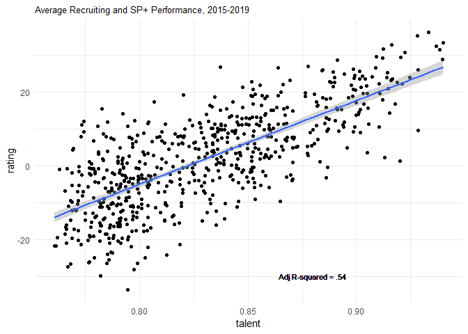
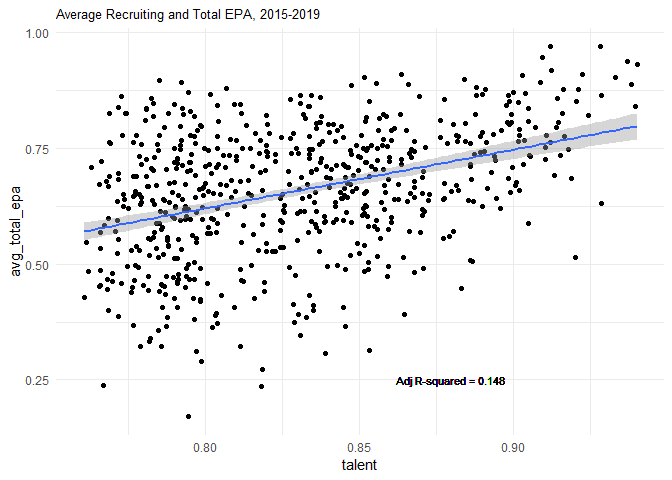
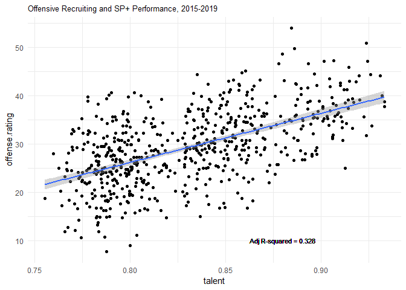
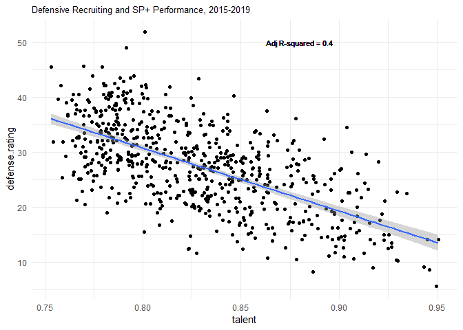
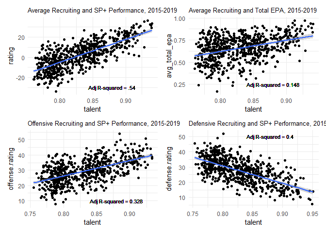
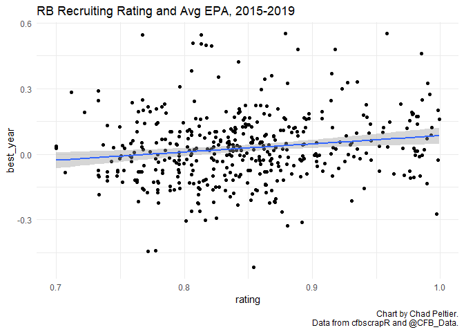
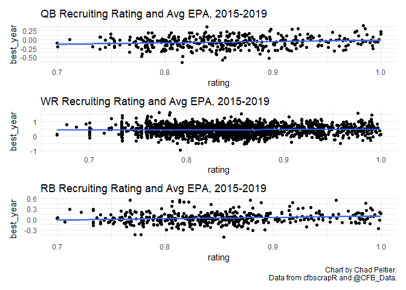

This project is designed to explore the relationship between player talent and performance at both the team and individual levels.

ESPN's Bill Connelly has often said that team performance (and therefore coaches' responsibilities) can be divided into three tasks: (1) Talent accumulation -- i.e. recruiting, (2) Player development -- everything related to coaching players not on actual game days, and (3) Player deployment -- the tactics, game strategy, scheme, and other in-game decisions. 

This project then is designed to take the first steps at quantifying the impact of the first aspect of team performance -- talent accumulation. There is broad agreement that talent accumulation matters, but it's unclear exactly how much of team performance is actually due to talent alone and how much is due to the other two factors Connelly identified -- development and deployment. 

Banner Society's Bud Elliott has long maintained that a team's "[Blue Chip Ratio](https://www.bannersociety.com/pages/blue-chip-ratio-2019)" -- or the ratio of four- and five-star players a team has -- must be over 50% for a team to have a realistic shot of winning the national championship. 

This is particularly interesting when we look at a team like Wisconsin, which isn't among the Blue Chip Ratio teams, but regularly is among the best teams in the Big Ten and in the country -- both as rated by the polls and by advanced statistics like Connelly's SP+. The Badgers seem to regularly outperform their talent levels. 

This project is therefore a first look into analyzing the relationship between talent accumulation and overall team performance, which should allow us to better identify which teams outperform their talent and which teams underperform based on their talent as well. That information could then allow for follow-on studies that look at the commonalities of teams that over- and underperform. We will also break down our analysis by offense and defense to see if overall team-level trends also hold up on individual sides of the ball. 

Finally, we'll also test this relationship at the individual player level -- are individual skill players' (running backs, wide receivers, and quarterbacks) talent ratings related to their actual performance in college?

We will test these relationships using talent data from the 247 Sports Composite player ratings (which normalizes recruiting ratings from all of the major recruiting services), SP+ data for team performance, and expected points added (EPA) data for player performance.

### Read in SP+ data 
First we'll go ahead and read in the SP+ data between 2015-2019. This method uses a functional to read the files (saved as "sp_year" in my local directory) into a list. SP+ data is available from the collegefootballdata.com API.


```r
library(tidyverse)
library(cfbscrapR)
library(forecast)
```

```
## Registered S3 method overwritten by 'xts':
##   method     from
##   as.zoo.xts zoo
```

```
## Registered S3 method overwritten by 'quantmod':
##   method            from
##   as.zoo.data.frame zoo
```

```
## Registered S3 methods overwritten by 'forecast':
##   method             from    
##   fitted.fracdiff    fracdiff
##   residuals.fracdiff fracdiff
```

```r
sp_data <- list.files(pattern = "sp_") %>%
    map_df(~read_csv(.))
```

```
## Parsed with column specification:
## cols(
##   .default = col_double(),
##   team = col_character(),
##   conference = col_character()
## )
```

```
## See spec(...) for full column specifications.
```

```
## Parsed with column specification:
## cols(
##   .default = col_double(),
##   team = col_character(),
##   conference = col_character()
## )
```

```
## See spec(...) for full column specifications.
```

```
## Parsed with column specification:
## cols(
##   .default = col_double(),
##   team = col_character(),
##   conference = col_character()
## )
```

```
## See spec(...) for full column specifications.
```

```
## Parsed with column specification:
## cols(
##   .default = col_double(),
##   team = col_character(),
##   conference = col_character()
## )
```

```
## See spec(...) for full column specifications.
```

```
## Parsed with column specification:
## cols(
##   .default = col_logical(),
##   year = col_double(),
##   team = col_character(),
##   conference = col_character(),
##   rating = col_double(),
##   offense.rating = col_double(),
##   defense.rating = col_double(),
##   specialTeams.rating = col_double()
## )
```

```
## See spec(...) for full column specifications.
```

```
## Parsed with column specification:
## cols(
##   `<U+0089>PNG` = col_character()
## )
```

```
## Warning: 324 parsing failures.
## row         col  expected        actual                file
##   2 <U+0089>PNG           embedded null 'talent_sp_def.png'
##   3 <U+0089>PNG           embedded null 'talent_sp_def.png'
##   4 <U+0089>PNG           embedded null 'talent_sp_def.png'
##   4 NA          1 columns 2 columns     'talent_sp_def.png'
##   7 NA          1 columns 2 columns     'talent_sp_def.png'
## ... ........... ......... ............. ...................
## See problems(...) for more details.
```

```
## Parsed with column specification:
## cols(
##   `<U+0089>PNG` = col_character()
## )
```

```
## Warning: 308 parsing failures.
## row         col  expected        actual                file
##   2 <U+0089>PNG           embedded null 'talent_sp_off.png'
##   3 <U+0089>PNG           embedded null 'talent_sp_off.png'
##   3 NA          1 columns 8 columns     'talent_sp_off.png'
##   4 <U+0089>PNG           embedded null 'talent_sp_off.png'
##   5 NA          1 columns 2 columns     'talent_sp_off.png'
## ... ........... ......... ............. ...................
## See problems(...) for more details.
```


# Talent vs. SP+ 
We'll use the same method to read in the talent data, also downloaded from collegefootballdata.com. 

Then we'll need to do a little bit of cleaning to make the talent data easier to use. The positions are a little more granular than we both need and want; sometimes there is very little distinction between similar positions (i.e. All-Purpose Backs (APB) and Running Backs) and other times the differences between position are too subjective or small for us to reliably differentiate between them (i.e. dual threat vs. pro-style quarterbacks, or strongside and weakside defensive ends). 


```r
pull_talent_year <- function(years){
    list_talent <- list()
    talent_data_2 <- data.frame()
    
    for(y in 1:length(years)){
      model <- cfb_recruiting(years[y])
      df <- data.frame(model)
      talent_data_2 <- bind_rows(talent_data_2, df)
    }
    list_talent[[y]] <- talent_data_2
}

talent_data <- pull_talent_year(2012:2019)


talent_data <- talent_data %>%
    mutate(position = replace(position, position == "APB", "RB"),
           position = replace(position, position == "ILB" | position == "OLB", "LB"),
           position = replace(position, position == "OC" | position == "OG" 
                              | position == "OT", "OL"),
           position = replace(position, position == "DUAL" | position == "PRO", "QB"),
           position = replace(position, position == "SDE" | position == "WDE", "DE"),
           position = replace(position, position == "APB", "RB")) %>%
  filter(position != "FB" & position != "K" & position != "P" & position != "RET" 
           & position != "LS") %>%
  mutate(off_def = if_else(position == "WR" | position == "RB" | position == "QB" 
                           | position == "OL" | position == "TE", "offense", 
                           if_else(position == "DE" | position == "DT" | position == "LB" 
                                   | position == "CB" | position == "S", "defense", "other")),
         year = as.numeric(year)
    
  )
```

Next we'll take a 4-year moving average in order to estimate a team's average talent in any given year. A 4-year average is used to approximate the players that are on a team at any given time -- some players are only on the team for 3 years before going to the NFL, while others take a redshirt year and stay for 5. So 4 years is a close approximation of the average talent that is on a roster at any given time, especially absent actual roster data for each year we're studying. 

After we take the 4-year moving averages, we'll join the talent data with SP+ performance data for that team.


```r
## moving 4 yr talent avg
ma_4yr <- function(y,yr, r){
    mean(r[yr == (y-3) | yr == (y-2) | yr == (y-1) | yr == y])
}


talent_sum <- talent_data %>%
    group_by(committedTo) %>%
    summarize(`2015`  = ma_4yr(2015, year, rating),
              `2016` = ma_4yr(2016, year, rating),
              `2017` = ma_4yr(2017, year, rating),
              `2018` = ma_4yr(2018, year, rating),
              `2019` = ma_4yr(2019, year, rating))
    
## pivot 
talent_sum <- talent_sum %>%
    pivot_longer(2:6, names_to = "avg_talent") %>%
    mutate(avg_talent = as.numeric(avg_talent)) %>%
    rename(team = committedTo, year = avg_talent, talent = value)

## join with SP+ data
talent_test <- talent_sum %>% 
    left_join(sp_data, by = c("team", "year")) %>%
    filter(rating != is.na(rating))
```


### Linear Regression
Next we'll run a linear regression between the team's 4-year average talent and their overall SP+ performance. We'll also plot that data on a scatter plot. 


```r
## find model and plot it
model <- lm(rating ~ talent, data = talent_test)
summary(model)
```

```
## 
## Call:
## lm(formula = rating ~ talent, data = talent_test)
## 
## Residuals:
##      Min       1Q   Median       3Q      Max 
## -27.5163  -6.2747   0.3133   6.3377  24.4041 
## 
## Coefficients:
##             Estimate Std. Error t value Pr(>|t|)    
## (Intercept) -186.647      6.813  -27.40   <2e-16 ***
## talent       227.119      8.201   27.69   <2e-16 ***
## ---
## Signif. codes:  0 '***' 0.001 '**' 0.01 '*' 0.05 '.' 0.1 ' ' 1
## 
## Residual standard error: 8.82 on 634 degrees of freedom
## Multiple R-squared:  0.5474,	Adjusted R-squared:  0.5467 
## F-statistic: 766.9 on 1 and 634 DF,  p-value: < 2.2e-16
```

```r
p1 <- ggplot(data = talent_test, aes(x = talent, y = rating)) + 
    geom_point() +
    geom_smooth(method = lm) +
    ggtitle("Average Recruiting and SP+ Performance, 2015-2019") +
    theme_minimal() +
    theme(plot.title = element_text(size = 10)) + 
    geom_text(x=.88, y=-30, label="Adj R-squared = .54", size = 3)+
    ggsave("talent_sp.png", height = 9/1.2, width = 16/1.2)

p1
```

<!-- -->

There appears to be a strong positive relationship between talent and team performance as measured by overall SP+ ratings. Interestingly, talent appears to explain roughly 55% of the variation in team SP+ performance, meaning that talent accumulation explains performance more than development and/or deployment (although both conceps are more difficult to quantify, and so we can't test their effects as easily in our model.)

## Talent Development and Deployment
While we can't test talent development and deployment against talent accumulation in the model above, we can get a sense for their effect by looking at the residuals between the model and the actual data. 

Essentially, teams that have a positive difference between the model and their actual SP+ performance rating out-played their expected performance -- theoretically because of strong development/deployment. We might expect that these teams have some kind of schematic advantage or are well-known for identifying "diamonds in the rough" in recruiting, then developing these players well. The opposite -- teams that have worse performance than expected relative to their talent -- underperform. For these teams we might look for extenuating circumstances, poor coaching, or high coach turnover.

In short, the residuals will allow us to better identify other potentially important variables to assess teams and coaching.


```r
## create function and add columns with predicted SP+ ratings, residuals
sp_predict <- function(talent){
  -187.425 + (227.99 * talent)
}

talent_test <- talent_test %>%
    mutate(predict_rating = sp_predict(talent = talent),
           residual = rating-predict_rating) %>%
    select(team, year, talent, rating, predict_rating, residual)

## see which teams outperformed their predicted SP+ rating (using residuals column)
talent_test %>%
    group_by(team) %>%
    summarize(avg_residual = mean(residual)) %>%
    arrange(desc(avg_residual)) %>%
    head(10)
```

```
## # A tibble: 10 x 2
##    team              avg_residual
##    <chr>                    <dbl>
##  1 Appalachian State        17.9 
##  2 Wisconsin                15.1 
##  3 Memphis                  14.6 
##  4 Air Force                13.5 
##  5 Navy                     13.0 
##  6 Ohio                     10.6 
##  7 Clemson                   9.82
##  8 Temple                    9.73
##  9 Oklahoma                  9.14
## 10 Utah State                9.10
```

```r
talent_test %>%
    group_by(team) %>%
    summarize(avg_residual = mean(residual)) %>%
    arrange(avg_residual) %>%
    head(10)
```

```
## # A tibble: 10 x 2
##    team           avg_residual
##    <chr>                 <dbl>
##  1 Rutgers              -14.2 
##  2 Kansas               -12.9 
##  3 Connecticut          -12.5 
##  4 Rice                 -12.3 
##  5 Texas State          -11.6 
##  6 Oregon State         -11.4 
##  7 UTEP                 -10.8 
##  8 UCLA                  -9.84
##  9 UT San Antonio        -9.20
## 10 Texas                 -9.03
```

This is a very interesting list. Seven of the teams are high-performing Group of 5 teams, which we might expect since these teams have structural disadvantages in recruiting, but nevertheless perform at a very high level. 


Before we go on, it might be worth checking a slightly different dependent variable instead of overall SP+ rating to see if the relationship still holds up between talent and team performance. So we'll use "Total EPA", an average of a team's offensive and defensive EPA percentiles for a given year. In my project "Data Cleaning and Exploratory Analysis of the 2019 College Football Season Using Expected Points Added (EPA) Data", I cleaned and created summary EPA data for teams based on cfbscrapR's EPA data. For each team's offensive and defensive season average EPA, I calculated z-scores and then associated percentiles (allowing you to say that "there is a xx% chance that a randomly selected team has a lower average EPA than team X"). So we'll use an average of a team's offensive and defensive EPA percentiles to calculate "Total EPA." To see the script for Total EPA, take a look at "avg_epa_15_19.R" in my Github.


```r
season_epa_15_19 <- read_csv("season_epa_15_19.csv")
```

```
## Warning: Missing column names filled in: 'X1' [1]
```

```
## Parsed with column specification:
## cols(
##   X1 = col_double(),
##   team = col_character(),
##   season = col_double(),
##   avg_epa_p_off = col_double(),
##   avg_epa_p_def = col_double(),
##   avg_total_epa = col_double()
## )
```

```r
season_epa_15_19 <- season_epa_15_19 %>%
    rename(year = season) %>%
    mutate(year = as.numeric(year))

talent_epa <- talent_test %>%
    inner_join(season_epa_15_19, by = c("team", "year"))

model_epa <- lm(avg_total_epa ~ talent, data = talent_epa)
summary(model_epa)
```

```
## 
## Call:
## lm(formula = avg_total_epa ~ talent, data = talent_epa)
## 
## Residuals:
##      Min       1Q   Median       3Q      Max 
## -0.44309 -0.08021  0.01406  0.09382  0.29431 
## 
## Coefficients:
##             Estimate Std. Error t value Pr(>|t|)    
## (Intercept) -0.39349    0.09975  -3.945 8.88e-05 ***
## talent       1.26732    0.12008  10.554  < 2e-16 ***
## ---
## Signif. codes:  0 '***' 0.001 '**' 0.01 '*' 0.05 '.' 0.1 ' ' 1
## 
## Residual standard error: 0.1291 on 634 degrees of freedom
## Multiple R-squared:  0.1494,	Adjusted R-squared:  0.1481 
## F-statistic: 111.4 on 1 and 634 DF,  p-value: < 2.2e-16
```

```r
p2 <- ggplot(data = talent_epa, aes(x = talent, y = avg_total_epa)) + 
    geom_point() +
    geom_smooth(method = lm) +
    ggtitle("Average Recruiting and Total EPA, 2015-2019") +
    theme_minimal() +
    theme(plot.title = element_text(size = 10)) + 
    geom_text(x=.88, y=.25, label="Adj R-squared = 0.148", size = 3)
    ggsave("talent_epa.png", height = 9/1.2, width = 16/1.2)

p2 
```

<!-- -->

While talent and team EPA are related, the adjusted R-squared is significantly lower (.148) than it was with SP+. That could be because SP+ is opponent-adjusted while Total EPA isn't. 

# Offense
We can also do the same tests as above, but for offenses and defenses. The following code recreates the same regression and chart for offenses.


```r
talent_off <- talent_data %>%
    filter(off_def == "offense") %>%
    group_by(committedTo) %>%
    summarize(`2015`  = ma_4yr(2015, year, rating),
              `2016` = ma_4yr(2016, year, rating),
              `2017` = ma_4yr(2017, year, rating),
              `2018` = ma_4yr(2018, year, rating),
              `2019` = ma_4yr(2019, year, rating))

## pivot 
talent_off <- talent_off %>%
    pivot_longer(2:6, names_to = "avg_talent") %>%
    mutate(avg_talent = as.numeric(avg_talent)) %>%
    rename(team = committedTo, year = avg_talent, talent = value)

## join with SP+ data
talent_test_off <- talent_off %>% 
    left_join(sp_data, by = c("team", "year")) %>%
    filter(rating != is.na(rating))

## find model and plot it
model_off <- lm(offense.rating ~ talent, data = talent_test_off)
summary(model_off)
```

```
## 
## Call:
## lm(formula = offense.rating ~ talent, data = talent_test_off)
## 
## Residuals:
##      Min       1Q   Median       3Q      Max 
## -17.2424  -4.0831  -0.1757   4.0650  19.1926 
## 
## Coefficients:
##             Estimate Std. Error t value Pr(>|t|)    
## (Intercept)  -55.085      4.799  -11.48   <2e-16 ***
## talent       101.612      5.767   17.62   <2e-16 ***
## ---
## Signif. codes:  0 '***' 0.001 '**' 0.01 '*' 0.05 '.' 0.1 ' ' 1
## 
## Residual standard error: 6.219 on 634 degrees of freedom
## Multiple R-squared:  0.3287,	Adjusted R-squared:  0.3276 
## F-statistic: 310.4 on 1 and 634 DF,  p-value: < 2.2e-16
```

```r
p3 <- ggplot(data = talent_test_off, aes(x = talent, y = offense.rating)) + 
    geom_point() +
    geom_smooth(method = lm) + 
    ggtitle("Offensive Recruiting and SP+ Performance, 2015-2019") +
    theme_minimal() +
    theme(plot.title = element_text(size = 10)) + 
    geom_text(x=.88, y=10, label="Adj R-squared = 0.328", size = 3)
    ggsave("talent_sp_off.png", height = 9/1.2, width = 16/1.2)

p3
```

<!-- -->

```r
## create function and add columns with predicted SP+ ratings, residuals
sp_predict_off <- function(talent){
  -55.480 + (102.049 * talent)
}
talent_test_off <- talent_test_off %>%
    mutate(predict_rating = sp_predict_off(talent = talent),
           residual = offense.rating - predict_rating) %>%
    select(team, year, talent, offense.rating, predict_rating, residual)

## see which teams outperformed their predicted SP+ rating (using residuals column)
talent_test_off %>%
    group_by(team, year) %>%
    summarize(avg_residual = mean(residual)) %>%
    arrange(desc(avg_residual)) %>%
    head(10)
```

```
## # A tibble: 10 x 3
## # Groups:   team [6]
##    team              year avg_residual
##    <chr>            <dbl>        <dbl>
##  1 Oklahoma          2018         19.2
##  2 Navy              2016         15.9
##  3 Western Kentucky  2016         15.6
##  4 Western Kentucky  2015         15.1
##  5 Navy              2015         15.0
##  6 Oklahoma          2017         14.9
##  7 South Florida     2016         14.7
##  8 Bowling Green     2015         14.5
##  9 Oklahoma          2016         14.4
## 10 Toledo            2016         14.2
```

Notably, the adjusted R-squared is significantly lower for offensive recruits and offensive SP+. This could mean a few things. Most likely, talent just might not be as much of a predictor for offensive performance as talent seems to be for overall team performance. Coaches may be able to design offenses that are able to use lesser-rated players but still perform at a high level. Examples of this might be Memphis, Washington State, and UCF, none of whom are elite recruiters, but all of which have high-powered offenses. 

The list of teams that outperform their recruiting is interesting. Oklahoma makes the list three times, Navy twice, and Western Kentucky twice. Oklahoma has had the best or among the best offenses in the country since Lincoln Riley got to Norman, so it's unsurprising that the Sooners are outperforming their talent, even if they do recruit at a high level already. Navy isn't too surprising either, since triple option offenses -- or more generally, offenses that have a clearly defined identity -- can produce at a relatively high level despite the structural disadvantages that service academies have in recruiting. And Western Kentucky (as well as a few other Group of 5 schools) making the list aren't surprising either -- these are the Group of 5 teams that punch above their recruiting weight. Western Kentucky's inclusion comes from some of Jeff Brohm's (now at Purdue) best years. 

# Defense
We can also do the same test for defensive talent and production as well.


```r
talent_def <- talent_data %>%
    filter(off_def == "defense") %>%
    group_by(committedTo) %>%
    summarize(`2015`  = ma_4yr(2015, year, rating),
              `2016` = ma_4yr(2016, year, rating),
              `2017` = ma_4yr(2017, year, rating),
              `2018` = ma_4yr(2018, year, rating),
              `2019` = ma_4yr(2019, year, rating))

## pivot 
talent_def <- talent_def %>%
    pivot_longer(2:6, names_to = "avg_talent") %>%
    mutate(avg_talent = as.numeric(avg_talent)) %>%
    rename(team = committedTo, year = avg_talent, talent = value)

## join with SP+ data
talent_test_def <- talent_def %>% 
    left_join(sp_data, by = c("team", "year")) %>%
    filter(rating != is.na(rating))

## find model and plot it
model_def <- lm(defense.rating ~ talent, data = talent_test_def)
summary(model_def)
```

```
## 
## Call:
## lm(formula = defense.rating ~ talent, data = talent_test_def)
## 
## Residuals:
##      Min       1Q   Median       3Q      Max 
## -16.0400  -4.5565   0.0474   4.1871  21.2451 
## 
## Coefficients:
##             Estimate Std. Error t value Pr(>|t|)    
## (Intercept)  122.246      4.624   26.44   <2e-16 ***
## talent      -114.344      5.576  -20.50   <2e-16 ***
## ---
## Signif. codes:  0 '***' 0.001 '**' 0.01 '*' 0.05 '.' 0.1 ' ' 1
## 
## Residual standard error: 6.134 on 634 degrees of freedom
## Multiple R-squared:  0.3988,	Adjusted R-squared:  0.3978 
## F-statistic: 420.5 on 1 and 634 DF,  p-value: < 2.2e-16
```

```r
p4 <- ggplot(data = talent_test_def, aes(x = talent, y = defense.rating)) + 
    geom_point() +
    geom_smooth(method = lm) +
    ggtitle("Defensive Recruiting and SP+ Performance, 2015-2019") +
    theme_minimal() +
    theme(plot.title = element_text(size = 10)) + 
    geom_text(x=.88, y=50, label="Adj R-squared = 0.4", size = 3)
    ggsave("talent_sp_def.png", height = 9/1.2, width = 16/1.2)

p4
```

<!-- -->

```r
## create function and add columns with predicted SP+ ratings, residuals
sp_predict_def <- function(talent){
  122.730 + (-114.887 * talent)
}
talent_test_def <- talent_test_def %>%
    mutate(predict_rating = sp_predict_def(talent = talent),
           residual = defense.rating - predict_rating) %>%
    select(team, year, talent, defense.rating, predict_rating, residual)

## see which teams outperformed their predicted SP+ rating (using residuals column)
talent_test_def %>%
    group_by(team, year) %>%
    summarize(avg_residual = mean(residual)) %>%
    arrange((avg_residual)) %>%
    head(10)
```

```
## # A tibble: 10 x 3
## # Groups:   team [7]
##    team               year avg_residual
##    <chr>             <dbl>        <dbl>
##  1 Wisconsin          2017        -16.1
##  2 Wisconsin          2015        -15.7
##  3 Boston College     2015        -15.6
##  4 Fresno State       2018        -15.2
##  5 Appalachian State  2018        -13.9
##  6 Northern Illinois  2017        -13.7
##  7 Appalachian State  2016        -13.7
##  8 Kent State         2015        -13.4
##  9 Wisconsin          2016        -13.2
## 10 San Diego State    2019        -13.0
```

This is also very interesting. Defensive recruiting seems to account for more of the variation in defensive SP+ performance than does offensive recruiting, giving credence to what Bud Elliott and others have noted -- talent matters more on the defensive side of the ball. 

Three Wisconsin teams make the list of teams that outperformed their defensive recruiting, along with two from App State and a number of other mostly Group of 5 teams.

Now let's combine all of these team-level charts into a summary chart. 

```r
library(patchwork)

patchwork <- plot_layout(p1 + p2 + p3 + p4)

patchwork
```

```
## $ncol
```

<!-- -->

```
## 
## $nrow
## NULL
## 
## $byrow
## NULL
## 
## $widths
## NULL
## 
## $heights
## NULL
## 
## $guides
## NULL
## 
## $tag_level
## NULL
## 
## $design
## NULL
## 
## attr(,"class")
## [1] "plot_layout"
```

```r
ggsave("talent_tests.png", height = 9/1.2, width = 16/1.2)
```


# Talent vs. Performance for Individual Skill Players
In addition to seeing how average EPA is related to team performance as measured by SP+, we can also test whether talent is related to performance at an individual level. We can do this by looking at average EPA by skill player -- running backs, quarterbacks, and wide receivers. 

First we need to write a function to pull in all EPA pbp data and clean it:


```r
get_pbp_years <- function(years){
    list_of_pbp <- list()
    for(y in 1:length(years)){
        pbp_year <- data.frame()
        for(i in 1:15){
            model <- cfb_pbp_data(year = years[y], season_type = "both", week = i, epa_wpa = TRUE)
            df <- data.frame(model)
            pbp_year <- bind_rows(pbp_year, df)
            pbp_year <- pbp_year %>%
                mutate(season = years[y])
        }
        list_of_pbp[[y]] <- pbp_year
    }
    return(list_of_pbp)
}

## Run function and combine data frames into single data frame
years_for_pbp <- as.character(c(2015:2019))
pbp_test <- get_pbp_years(years = years_for_pbp)
```

```
## Warning in log(adj_yd_line): NaNs produced
```

```r
pbp_15_19 <- bind_rows(pbp_test)

## Clean data 
pbp_15_19 <- pbp_15_19 %>%
  rename(adjusted_yardline = adj_yd_line,
         offense = offense_play,
         defense = defense_play) %>%
  mutate(rz_play = ifelse((adjusted_yardline <= 20), 1, 0), 
         so_play = ifelse((adjusted_yardline <= 40 | play_type == "(Passing Touchdown) | (Rushing Touchdown"), 1, 0),
         pass = if_else(play_type == "Pass Reception" | play_type == "Passing Touchdown" |
                          play_type == "Sack" | play_type == "Pass Interception Return" |
                          play_type == "Pass Incompletion" | play_type == "Sack Touchdown" |
                          (play_type == "Safety" & str_detect(play_text, "sacked")) |
                          (play_type == "Fumble Recovery (Own)" & str_detect(play_text, "pass")) |
                          (play_type == "Fumble Recovery (Opponent)" & str_detect(play_text, "pass")), 1, 0),
         rush = ifelse(play_type == "Rush" | play_type == "Rushing Touchdown" | (play_type == "Safety" & str_detect(play_text, "run")) |
                         (play_type == "Fumble Recovery (Opponent)" & str_detect(play_text, "run")) | 
                         (play_type == "Fumble Recovery (Own)" & str_detect(play_text, "run")), 1, 0),
         rush_pass = if_else(rush == 1, "rush", 
                             if_else(pass == 1, "pass", "NA")),
         stuffed_run = ifelse((rush == 1 & yards_gained <=0), 1, 0),
         opp_rate_run = ifelse((rush == 1 & yards_gained >= 4), 1, 0),
         epa_success = ifelse((rush == 1 | pass == 1) & EPA >= 0, 1, 0),
         epa_explosive = if_else((rush == 1 & EPA >= 1.7917221), 1, 
                                 if_else((pass == 1 & EPA >= 2.4486338), 1, 0)),
         short_rush_attempt = ifelse(distance <= 2 & rush == 1, 1, 0),
         short_rush_success = ifelse(distance <= 2 & rush == 1 & yards_gained >= distance, 1, 0),
         std.down = ifelse(down == 1, 1,
                        ifelse(down == 2 & distance < 8, 1, 
                           ifelse(down == 3 & distance < 5, 1,
                                  ifelse(down == 4 & distance < 5, 1, 0)))),
         pass.down = ifelse(down == 2 & distance > 8, 1, 
                            ifelse(down == 3 & distance > 5, 1, 
                                   ifelse(down == 4 & distance > 5, 1, 0))),
         year = 2019
)

pbp_15_19_rp <- pbp_15_19 %>%
    filter(rush_pass != "NA")


## Extract player names
# RB names 
pbp_15_19_rp <- pbp_15_19_rp %>%
    mutate(rush_player = ifelse(rush == 1, str_extract(play_text, "(.{0,25} )run |(.{0,25} )\\d{0,2} Yd Run"), NA)) %>%
    mutate(rush_player = str_remove(rush_player, " run | \\d+ Yd Run"))

# QB names 
pbp_15_19_rp <- pbp_15_19_rp %>%
    mutate(pass_player = ifelse(pass==1, str_extract(play_text, "pass from (.*?) \\(|(.{0,30} )pass |(.{0,30} )sacked|(.{0,30} )incomplete "), NA)) %>%
    mutate(pass_player = str_remove(pass_player, "pass | sacked| incomplete")) %>%
    mutate(pass_player = if_else(play_type == "Passing Touchdown", str_extract(play_text, "from(.+)"), pass_player),
          pass_player = str_remove(pass_player, "from "), 
          pass_player = str_remove(pass_player, "\\(.+\\)"),
          pass_player = str_remove(pass_player, " \\,"))

## Receiver names
pbp_15_19_rp <- pbp_15_19_rp %>%
    mutate(receiver_player = ifelse(pass==1, str_extract(play_text, "to (.+)"), NA)) %>%
    mutate(receiver_player = if_else(str_detect(play_text, "Yd pass"), str_extract(play_text, "(.+)\\d"), receiver_player)) %>%
    mutate(receiver_player = ifelse(play_type == "Sack", NA, receiver_player)) %>%
    mutate(receiver_player = str_remove(receiver_player, "to "),
           receiver_player = str_remove(receiver_player, "\\,.+"),
           receiver_player = str_remove(receiver_player, "for (.+)"),
           receiver_player = str_remove(receiver_player, "( \\d{1,2})"))


pbp_15_19_rp <- pbp_15_19_rp %>%
    mutate(pass_player = str_trim(pass_player),
           receiver_player = str_trim(receiver_player),
           rush_player = str_trim(rush_player))
```

## Quarterback talent and average EPA
Now we can look at specific skill position groups. We'll extract quarterback average EPA data, then join that data with recruiting data. 

Importantly, because we might have multiple years of player EPA data, I decided to first test that player's best year in terms of average EPA. This likely biases the results in favor of there being a relationship between talent and performance, but it is suitable for a first cut at the data. 


```r
## Create player summary dfs
qb <- pbp_15_19_rp %>%
    group_by(pass_player, season) %>%
    summarize(avg_epa = mean(EPA),
              plays = n()) %>%
    filter(plays > 120) 
      
    
## pivot 
qb <- qb %>%
    pivot_wider(names_from = season, values_from = c(avg_epa, plays))

## pick year for epa calc (best year)
qb <- qb %>%
    rowwise() %>%
    mutate(best_year = max(avg_epa_2017, avg_epa_2018, avg_epa_2019, avg_epa_2016, avg_epa_2015, na.rm = TRUE))

## join with talent data 
qb_tal <- qb %>%
    inner_join(talent_data, by = c("pass_player" = "name"))


## regression between talent and average EPA in the best year
model_qb <- lm(best_year ~ rating, data = qb_tal)
summary(model_qb)
```

```
## 
## Call:
## lm(formula = best_year ~ rating, data = qb_tal)
## 
## Residuals:
##      Min       1Q   Median       3Q      Max 
## -0.55809 -0.10495  0.00772  0.10901  0.44875 
## 
## Coefficients:
##             Estimate Std. Error t value Pr(>|t|)    
## (Intercept)  -0.4060     0.1079  -3.762 0.000195 ***
## rating        0.3814     0.1256   3.038 0.002545 ** 
## ---
## Signif. codes:  0 '***' 0.001 '**' 0.01 '*' 0.05 '.' 0.1 ' ' 1
## 
## Residual standard error: 0.1576 on 382 degrees of freedom
## Multiple R-squared:  0.02359,	Adjusted R-squared:  0.02104 
## F-statistic:  9.23 on 1 and 382 DF,  p-value: 0.002545
```

```r
p5 <- ggplot(data = qb_tal, aes(x = rating, y = best_year)) + 
    geom_point() + 
    geom_smooth(method = lm) +
    ggtitle("QB Recruiting Rating and Avg EPA, 2015-2019") +
    theme_minimal() +
    ggsave("talent_qb_epa.png", height = 9/1.2, width = 16/1.2)

p5
```

<!-- -->

Unlike the team recruiting and performance tests, the quarterback test's adjusted R-squared is incredibly low (0.022), meaning that average recruiting rating did not explain much of the variability in quarterbacks' best year measured by average EPA. 


## Wide receivers
Let's test for wide receivers now:


```r
## Create player summary dfs
wr <- pbp_15_19_rp %>%
    group_by(receiver_player, season) %>%
    summarize(avg_epa = mean(EPA),
              plays = n()) %>%
    filter(plays > 20) 
      
    
## pivot 
wr <- wr %>%
    pivot_wider(names_from = season, values_from = c(avg_epa, plays))

## pick year for epa calc (best year)
wr <- wr %>%
    rowwise() %>%
    mutate(best_year = max(avg_epa_2017, avg_epa_2018, avg_epa_2019, avg_epa_2016, avg_epa_2015, na.rm = TRUE))

## join with talent data 
wr_tal <- wr %>%
    inner_join(talent_data, by = c("receiver_player" = "name"))


## regression between talent and average EPA in the best year
model_wr <- lm(best_year ~ rating, data = wr_tal)
summary(model_wr)
```

```
## 
## Call:
## lm(formula = best_year ~ rating, data = wr_tal)
## 
## Residuals:
##      Min       1Q   Median       3Q      Max 
## -1.38422 -0.21679  0.01211  0.22134  1.19577 
## 
## Coefficients:
##             Estimate Std. Error t value Pr(>|t|)   
## (Intercept)   0.2857     0.1047   2.728  0.00643 **
## rating        0.1702     0.1237   1.376  0.16886   
## ---
## Signif. codes:  0 '***' 0.001 '**' 0.01 '*' 0.05 '.' 0.1 ' ' 1
## 
## Residual standard error: 0.3335 on 1752 degrees of freedom
## Multiple R-squared:  0.00108,	Adjusted R-squared:  0.0005101 
## F-statistic: 1.895 on 1 and 1752 DF,  p-value: 0.1689
```

```r
p6 <- ggplot(data = wr_tal, aes(x = rating, y = best_year)) + 
    geom_point() + 
    geom_smooth(method = lm) +
    ggtitle("WR Recruiting Rating and Avg EPA, 2015-2019") +
    theme_minimal() +
    ggsave("talent_wr_epa.png", height = 9/1.2, width = 16/1.2)

p6
```

<!-- -->

Unlike the test for quarterbacks, which at least had a p-value less than 0.05, we cannot reject the null that there's no relationship between a wide receiver's recruiting rating and their best season of performance in college as measured by average EPA. 

## Running backs 


```r
## Create player summary dfs
rb <- pbp_15_19_rp %>%
    group_by(rush_player, season) %>%
    summarize(avg_epa = mean(EPA),
              plays = n()) %>%
    filter(plays > 120) 
      
    
## pivot 
rb <- rb %>%
    pivot_wider(names_from = season, values_from = c(avg_epa, plays))

## pick year for epa calc (best year)
rb <- rb %>%
    rowwise() %>%
    mutate(best_year = max(avg_epa_2017, avg_epa_2018, avg_epa_2019, avg_epa_2016, avg_epa_2015, na.rm = TRUE))

## join with talent data 
rb_tal <- rb %>%
    inner_join(talent_data, by = c("rush_player" = "name"))


## regression between talent and average EPA in the best year
model_rb <- lm(best_year ~ rating, data = rb_tal)
summary(model_rb)
```

```
## 
## Call:
## lm(formula = best_year ~ rating, data = rb_tal)
## 
## Residuals:
##      Min       1Q   Median       3Q      Max 
## -0.54567 -0.09229 -0.00906  0.08168  0.54889 
## 
## Coefficients:
##             Estimate Std. Error t value Pr(>|t|)   
## (Intercept) -0.28930    0.09704  -2.981  0.00303 **
## rating       0.37335    0.11419   3.270  0.00116 **
## ---
## Signif. codes:  0 '***' 0.001 '**' 0.01 '*' 0.05 '.' 0.1 ' ' 1
## 
## Residual standard error: 0.1576 on 427 degrees of freedom
## Multiple R-squared:  0.02442,	Adjusted R-squared:  0.02214 
## F-statistic: 10.69 on 1 and 427 DF,  p-value: 0.001164
```

```r
p7 <- ggplot(data = rb_tal, aes(x = rating, y = best_year)) + 
    geom_point() + 
    geom_smooth(method = lm) +
  labs(caption = "Chart by Chad Peltier.
         Data from cfbscrapR and @CFB_Data.") +
    ggtitle("RB Recruiting Rating and Avg EPA, 2015-2019") +
    theme_minimal() +
    ggsave("talent_rb_EPA.png", height = 9/1.2, width = 16/1.2)

p7 
```

<!-- -->

Like with quarterbacks, there is a weak relationship between recruiting ratings and performance in your best year as measured by average EPA. 


```r
player_patchwork <- p5 / p6 / p7
player_patchwork 
```

<!-- -->

```r
ggsave("player_epa.png", height = 14/1.2, width = 16/1.2)
```


